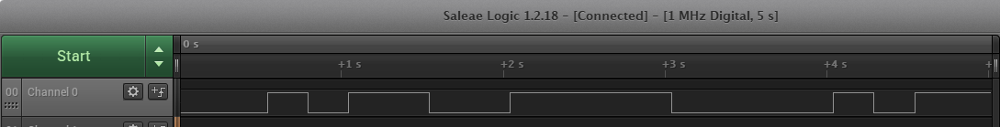
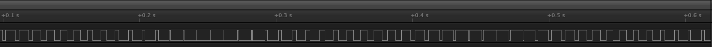

Name:Alison Jin

EID:AQJ82

Team Number: F4

## Questions

1. Why does your program need a setup and a loop?

    setup has the initialization that only needs to occur once. In this case, that's initializing that pin 2 is an output. loop is for code that needs to be looped. In this case, that's the call for timedBlink because we want the blinking pattern to repeat.

2. What is the downside to putting all your code in a loop?

    It's hard to debug and is messy to read. Having a function that is called in loop() makes it easier reuse code when needed and more organized.

3. Why does your code need to be compiled?

    The code needs to be translated into assembly by the compiler so that the microcontroller can actually understand the code.

4. When lowering the frequency in procedure A, step 4, what is going wrong? Brainstorm some solutions. Dimmers exist in the real world. What is their solution?

   The light flickers/strobes slow enough for people to see. In real dimmers, they can just keep the frequency high enough that it isn't visible to us.

5. Why do you need to connect the logic analyzer ground to the ESP32 ground?

    Like every other circuit, it needs to be grounded to have a reference voltage to compare other voltages it's measuring.

6. What is the difference between synchronous and asynchronous communication?

    Synchronous is when things are controlled together by the clock whil asynchronous means that things are not synced to one particular thing and can operate at different times and speeds based on what it is controlled by.

7. Profile of UART: Sent X bytes in Y time 

    your answer here

8. Profile of SPI: Sent X bytes in Y time

    your answer here

9. Why is SPI so much faster than UART?

    your answer here

10. list one pro and one con of UART

    your answer here

11. list one pro and one con of SPI

    your answer here

12. list one pro and one con of I2C

    your answer here

13. Why does I2C need external resistors to work?

    your answer here

## Screenshots

Procedure A, step 1:

Procedure A, step 4:

Procedure B, UART:

Procedure B, SPI:

